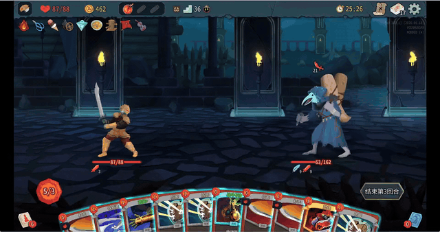
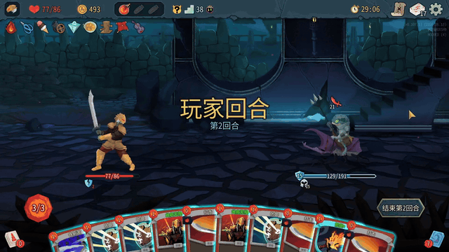
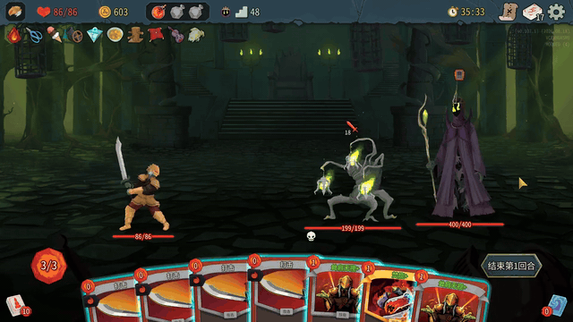
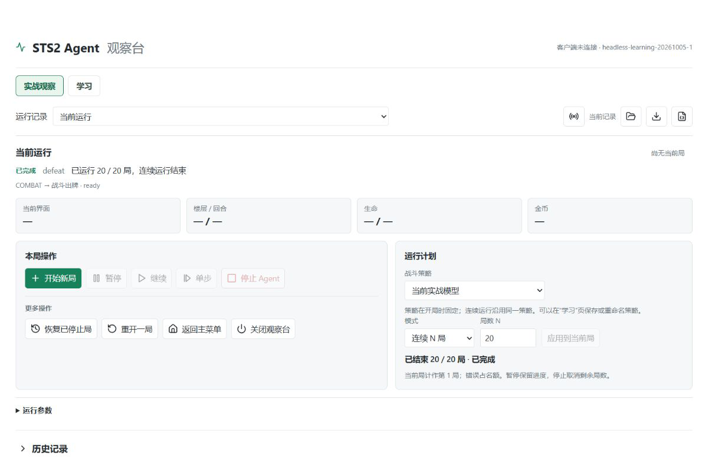
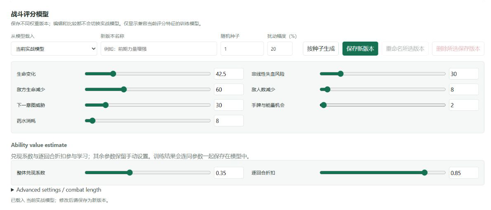
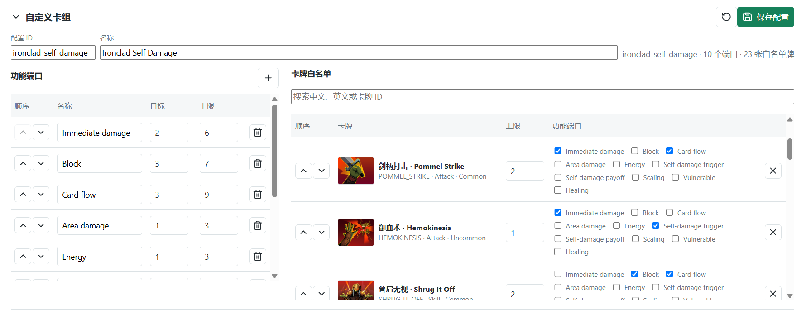

# 项目演示

本页用三段真实对局录屏和三张观察台截图，展示 Agent 如何执行战斗动作，以及本地观察台提供的运行、构筑与评分模型功能。项目目标、方法、当前成绩和运行方式见 [README](README.md)。

## 真实对局

### 自动出牌并结束战斗

Agent 在第 36 层连续选择攻击动作，击败敌人后进入奖励界面。短片剪去了动作之间的等待。

[打开清晰版短视频](demo/media/agent-turn.mp4)

### 能力收益与后续动作

第 38 层战斗片段中，Agent 打出获得力量的牌，随后继续处理攻防，最终成功拿下怪物。此镜头用于展示自动执行过程；单个出牌片段不构成策略优劣的评判。

[打开清晰版短视频](demo/media/power-card.mp4)

### 到达第 48 层

这一局进入第 48 层战斗，最终遗憾战败。短片省略了中间过程。

[打开清晰版短视频](demo/media/floor-48-defeat.mp4)

## 本地观察台

### 运行控制

观察台可选择战斗评分策略，运行单局或连续 N 局，并提供暂停、继续和停止等控制。截图记录的是一批 **20/20 局已结束**后的页面状态，并非正在运行的对局。

### 战斗评分模型

可以从现有模型载入参数、调整权重、按种子生成变体，并另存为新模型。界面中也展示了能力收益的兑现系数和逐回合折扣；模型比较与训练仍需要合格的对照样本。

### 自定义卡组

构筑界面允许为卡牌设定白名单、张数上限和功能端口，并调整端口与卡牌的优先顺序。截图中的配置是铁甲战士自伤流的一份实例。

---

短片仅剪去等待和录制软件画面，保留游戏原始画面；它们展示个别对局，不代表整体胜率。截图反映拍摄时的本地页面状态。
